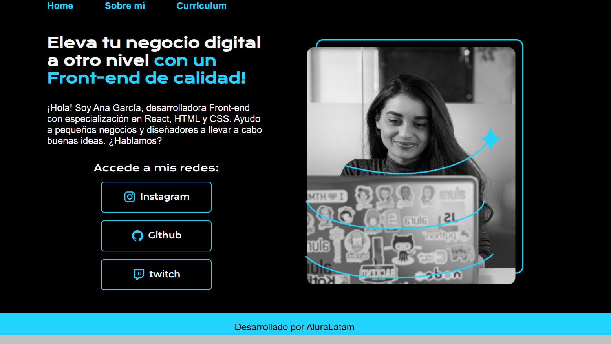

## Proyecto HTML y CSS by Alura Latam

El siguiente es un proyecto desarrollado en el contenido del curso de HTML y CSS por Alura Latam denominado Portafolio. 

## Imagen del proyecto

## 🔨 Funcionalidades del proyecto

Conocer HTML y CSS es indispesanble para cualquier profesional de tecnología. Estas habilidades permiten comprender la estructura y diseño de las páginas web, lo que facilita la comunicación con equipos de desarrollo y mejora la colaboración en proyectos digitales. Además, entender cómo se crean y estilizan las interfaces ayuda a optimizar el contenido para usuarios y buscadores. Todos los profesionales de cualquier área de técnología pueden beneficiarse al interpretar y ajustar elementos básicos de un sitio web, fortaleciendo su perfil técnico y mejorando la eficiencia en entornos tecnológicos.

## ✔️ Contenido del curso

✔️ `Ambientes de desarrollo, estructura de archivos y Tags`: Crea un proyecto desde cero con HTML y CSS.
✔️ `Clases, Posicionamiento y Flexbox`: Aprende a estilizar tus textos, fuentes e iconos
✔️ `header, footer y variables CSS`: Trabaja con más de una página HTML en el mismo proyecto
✔️ `trabajando con responsividad y publicación de proyectos`: Descubre qué es y cómo usar la Media Query en tus proyectos

## 📁 Acceso al proyecto

Acá encontrarás el contenido del proyecto, todas las contribuciones son bien recibidas !!!

https://github.com/RIBAL-1/Portafolio_Figma/tree/main
